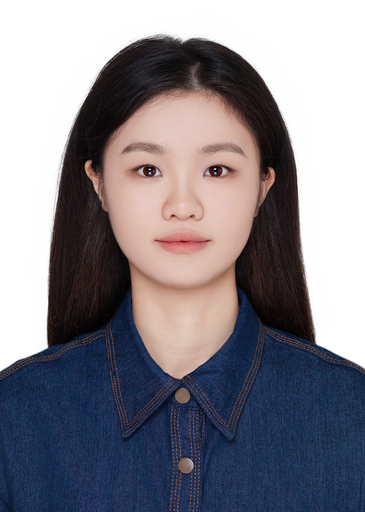
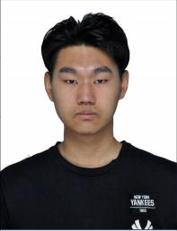

# Group introduction (研究组简介）
We are the Intelligent Control and Interaction Group of the Multimodal Information Perception and Security Laboratory of the School of Computer Science and Technology of Xinjiang University, abbreviated as ICIG.

我们是新疆大学计算机科学与技术学院多模态信息感知与安全实验室智能控制与交互小组，缩写为ICIG。

多模态信息感知与安全实验室（Multi-modal Information Perception and Security Laboratory，MIPS Lab）主页：xxxx。

# Resarch interests （研究兴趣）
Our group has the following research interests:

我们小组有以下的研究兴趣：

## Perception （智能体感知相关）
### 语音合成(Speech synthesis)
### 语音识别(Speech recognition)
### 语音增强 (Speech enhancement)
### 声源分离 (Sound source seperation)
### 情绪识别 (Emotion recognition)
### 能源系统态势感知（Situation awareness of energy systems）
### 一致性滤波（Consensus filtering）

## Sim 2 real （虚拟到现实）
### 场景生成 （Scene generation）
### 数字模拟人 (Digital person)
### 工业装备数字孪生建模（Digital twin modeling for industrial equipments）

## Dicision and Act （智能体决策相关）
### 视听导航(Audio-Visual Navigation)
### 视觉语言导航 (Visual Language Navigation)
### 工业能源系统优化调度（Optimal scheduling for industrial energy systems）
### 多智能体强化学习（Multi-agent reinforcement learning）

## Others (其他）
### Mandarin quality evaluation (普通话质量评测)
### Camouflaged object detection (伪装目标检测)
### Multi-temporal remote sensing image change detection (多时相遥感影像变化检测)
### dual-arm robot operation (双臂机器人操作)
### Mobile robot navigation and operation (移动机器人导航与操作)
### UAV algorithm research (无人机算法研究)

# Introduction to the group leader （小组负责人简介）
Yinfeng Yu, male, associate professor, master's tutor. Joined Xinjiang University in July 2011 to engage in teaching and scientific research. Obtained a PhD in Engineering from Tsinghua University in June 2023. His supervisor is Sun Fuchun, majoring in computer science and technology. In June 2023, he won the honorary title of "Excellent Graduate" from the Computer Science Department of Tsinghua University. In September 2023, he was hired as a master's tutor. Promoted to associate professor in December 2023. He has published more than 10 articles in total, including 2 papers as the first author in top international conferences such as International Joint Conference on Artificial Intelligence (IJCAI) and International Conference on Learning Representations (ICLR). Hosted 1 provincial and ministerial level vertical project (Autonomous Region Natural Science Foundation Youth Fund, Multi-temporal remote sensing image change detection based on X-let transformation, 2015211C288, 2015-01 to 2017-12, 50,000, completed). He serves as a member of the Intelligent Robot Professional Committee of the Computer Society of China and a member of the Speech Dialogue and Hearing Professional Committee of the Computer Society of China. Served as a reviewer for top international conferences such as ICASSP 2024, CVPR 2023, ICCV 2023, and ECCV 2022.

Personal homepage: https://yyf17.github.io/

余银峰，男，汉族，中共党员，副教授，硕士生导师。2011年7月加入新疆大学从事教学科研工作。2023年6月获清华大学工学博士学位，导师孙富春，专业是计算机科学与技术。2023年6月，荣获清华大学计算机系“优秀毕业生”的荣誉称号。2023年9月，受聘为硕士研究生导师。2023年12月晋升为副教授。共发表10余篇文章，其中以第一作者在International Joint Conference on Artificial Intelligence（IJCAI）、International Conference on Learning Representations （ICLR）等国际顶级会议发表论文2篇。主持1项省部级纵向课题（自治区自然科学基金青年基金，基于X-let变换的多时相遥感影像变化检测，2015211C288，2015-01至2017-12， 5万, 已结题）。担任中国计算机学会智能机器人专业委员会委员、中国计算机学会语音对话与听觉专业委员会委员。担任ICASSP 2024、CVPR 2023、ICCV 2023、ECCV 2022等国际顶级会议审稿人。

个人主页：https://yyf17.github.io/ 

# Students
## PhD student

## master student

### 2024
<table align="center" width="100%" height="800px">
  <tr>
    <td width="150" height="200">
      

        <a href="" target="_blank" class="image">
          
            
          
          <h2>王焱</h2>
          <h3>具身智能</h3>
        </a>
      

    </td>
    <td width="150" height="200">
      

        <a href="" target="_blank" class="image">
          
            
          
          <h2>贾路远</h2>
          <h3>具身智能</h3>
        </a>
      

    </td>
    <td width="150" height="200">
      

        <a href="" target="_blank" class="image">
          
            
          
          <h2>李佳</h2>
          <h3>具身智能</h3>
        </a>
      

    </td>
  </tr>
  <tr>
        <td width="150" height="200">
      

        <a href="" target="_blank" class="image">
          
            
          
          <h2>王焱</h2>
          <h3>具身智能</h3>
        </a>
      

    </td>
    <td width="150" height="200">
      

        <a href="" target="_blank" class="image">
          
            
          
          <h2>贾路远</h2>
          <h3>具身智能</h3>
        </a>
      

    </td>
    <td width="150" height="200">
      

        <a href="" target="_blank" class="image">
          
            
          
          <h2>李佳</h2>
          <h3>具身智能</h3>
        </a>
      

    </td>
  </tr>
    <tr>
        <td width="150" height="200">
      

        <a href="" target="_blank" class="image">
          
            
          
          <h2>王焱</h2>
          <h3>具身智能</h3>
        </a>
      

    </td>
    <td width="150" height="200">
      

        <a href="" target="_blank" class="image">
          
            
          
          <h2>贾路远</h2>
          <h3>具身智能</h3>
        </a>
      

    </td>
    <td width="150" height="200">
      

        <a href="" target="_blank" class="image">
          
            
          
          <h2>李佳</h2>
          <h3>具身智能</h3>
        </a>
      

    </td>
  </tr>
</table>

### 2023
<table align="center" width=100% height=800px>

<tr width=300, height=200>
  <td width=150, height=200>
      

       <a href="" target="_blank" class="image">
        
         
        
        <h2>杨东升   </h2>
        <h3>视听导航   </h3>
       </a>
      

  </td>

  <td width=150, height=200>
      

       <a href="" target="_blank" class="image">
        
         
        
        <h2>主田横   </h2>
        <h3>数字模拟人   </h3>
       </a>
      

  </td>
  
</tr>

<tr width=300, height=200>
  <td width=150, height=200>
      

       <a href="" target="_blank" class="image">
        
         
        
        <h2>孙世宇   </h2>
        <h3>视听导航   </h3>
       </a>
      

  </td>

  <td width=150, height=200>
      

       <a href="" target="_blank" class="image">
        
         
        
        <h2>朱涛   </h2>
        <h3>语音合成   </h3>
       </a>
      

  </td>
</tr>
 
</table>

# undergrad

# Paper Reading (文献阅读)

 [文献阅读](GroupReading.md)

# Contact with us

Contact person: Dr. Yu

Correspondence email: yyf17@tsinghua.org.cn
