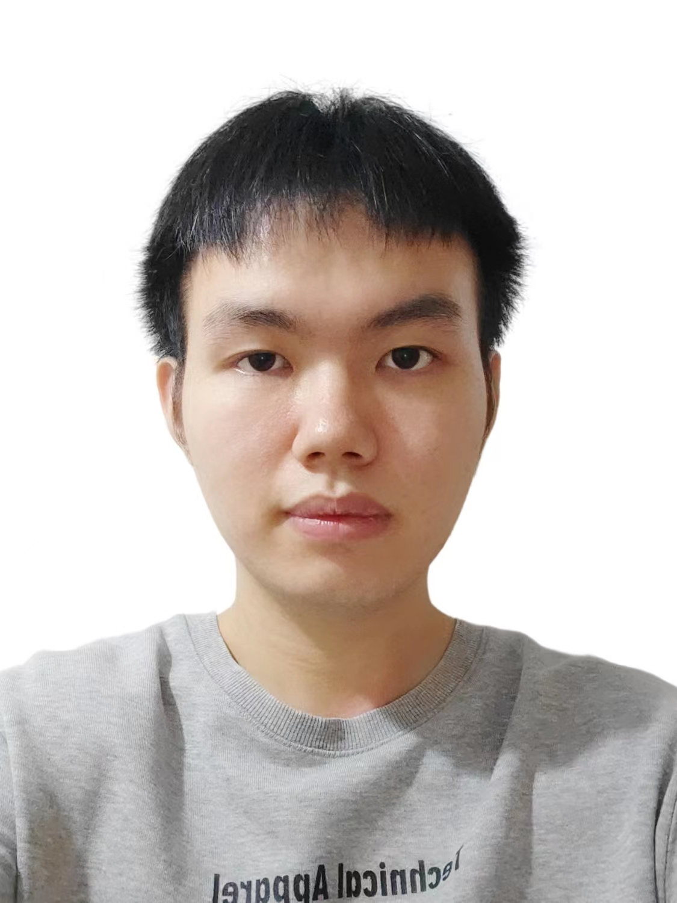

# Team introduction (研究组简介）
We are the Intelligent Control and Interaction Research Group of the School of Computer Science and Technology of Xinjiang University, abbreviated as XJU-ICIRG. The research objects of our group are sound, vision, etc., with the goal of realizing intelligent control and interaction. 

我们是新疆大学计算机科学与技术学院的智能控制与交互研究小组，缩写为XJU-ICIRG。我们小组的研究对象为声音、视觉等，目标是实现智能控制与交互。

# Resarch interests （研究兴趣）
Our group has the following research interests:

我们小组有以下的研究兴趣：

## Speech signal processing (语音信号处理)

### 1 Speech enhancement (语音增强)

#### Representative works （代表作） 
 
### 2 Mandarin quality evaluation (普通话质量评测)

#### Representative works （代表作） 

## Generate model (生成模型)

#### Representative works （代表作） 

### 3 Speech synthesis (语音合成)

#### Representative works （代表作） 

### 4 digital simulators (数字模拟人)
#### Representative works （代表作） 

## Image Processing (图像处理）

### 5 Camouflaged object detection (伪装目标检测)

#### Representative works （代表作） 

### 6 Multi-temporal remote sensing image change detection (多时相遥感影像变化检测)

#### Representative works （代表作） 

## Embodied intelligence (具身智能)
### 7 Audio-Visual Navigation (视听导航)
#### Representative works （代表作） 

### 8 Visual Language Navigation (视觉语言导航)
#### Representative works （代表作） 

### Reinforcement learning (强化学习)
### 9 dual-arm robot operation (双臂机器人操作)
#### Representative works （代表作） 

### 10 Mobile robot navigation and operation (移动机器人导航与操作)
#### Representative works （代表作） 

### 11 UAV algorithm research (无人机算法研究)
#### Representative works （代表作） 

# Students
## PhD student

## master

### 2023
<table align="center" width=100% height=400>

<tr>
  <td>
      

       <a href="" target="_blank" class="image">
        
         
        
        <h2>杨东升   </h2>
        <h3>视听导航   </h3>
       </a>
      

  </td>

  <td>

      

       <a href="" target="_blank" class="image">
        
         
        
        <h2>主田横   </h2>
        <h3>数字模拟人   </h3>
       </a>
      

   
  </td>
  
</tr>

<tr>
  <td>
      

       <a href="" target="_blank" class="image">
        
         
        
        <h2>孙世宇   </h2>
        <h3>伪装目标检测   </h3>
       </a>
      

  </td>

  <td>
      

       <a href="" target="_blank" class="image">
        
         
        
        <h2>朱涛   </h2>
        <h3>语音合成   </h3>
       </a>
      

  </td>
</tr>
 
</table>

## undergrad

Contact person: Dr. Yu

Correspondence email: yyf17@tsinghua.org.cn
